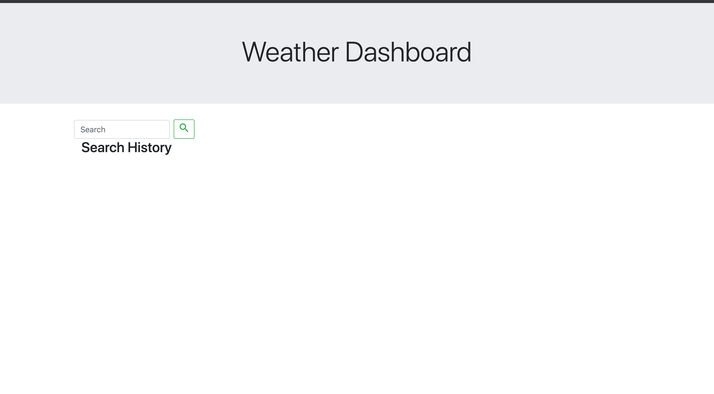
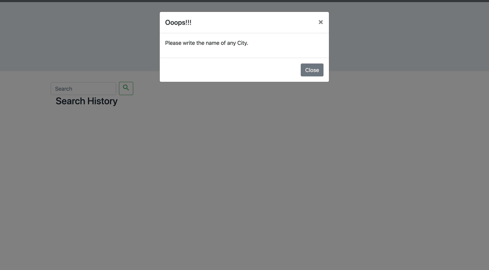
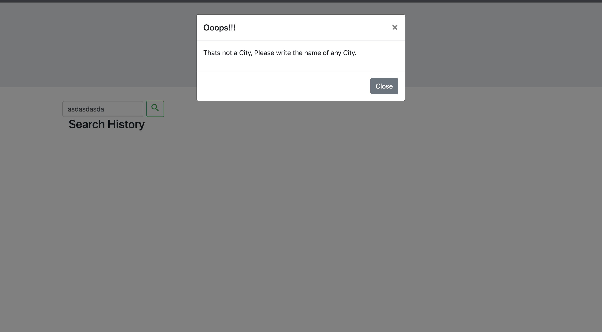
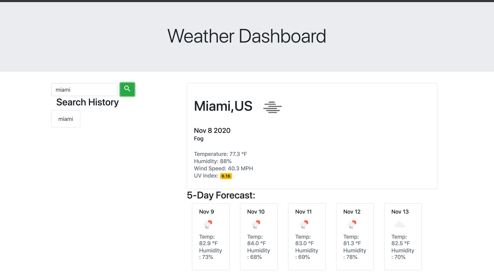
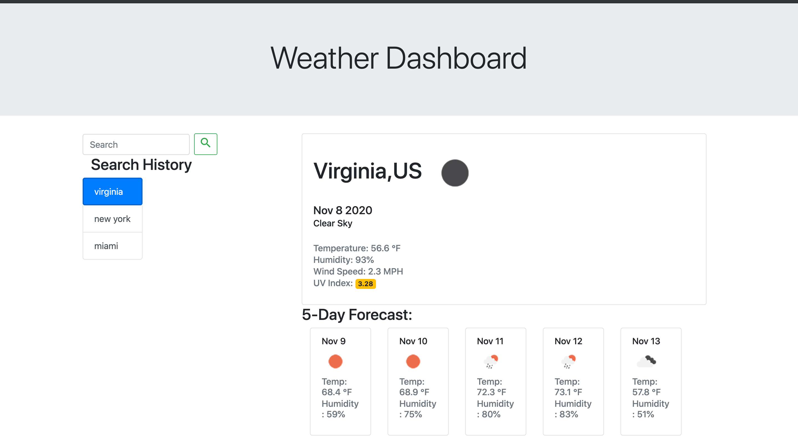
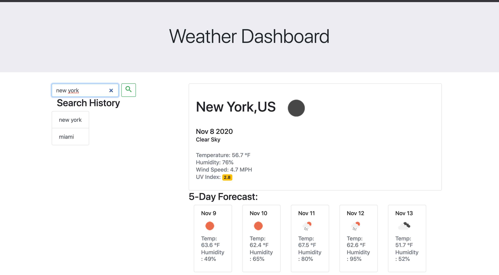

# Weather Dashboard

This Weather Dashboard will show you weather conditions for x city.
# 
[link to deployed app](https://proudfer000.github.io/weather-dashboard/)
#

## Usage

**When** Write **City Name** user will be presented with relevant information about the **Weather**. 
#

**IF** the user doesn't write write anything it will be presented with a modal asking to write the name of a city.
#

**IF** the user doesn't write the actual name of a city it will be presented with a modal asking to write the name of a city..

**When** the user executes a search it will be saved in the search history. The search history will hold up to 10 city names, if the city name already exist in the search history the entry wont be repeated. 

**IF** the user already have 10 city in the search history the oldest entry will be removed and the new search added.
#

#

#

### Hope you Enjoy it!!!

### Ps: By the time you review this app the appearance may have change, but functionality will be the same.
